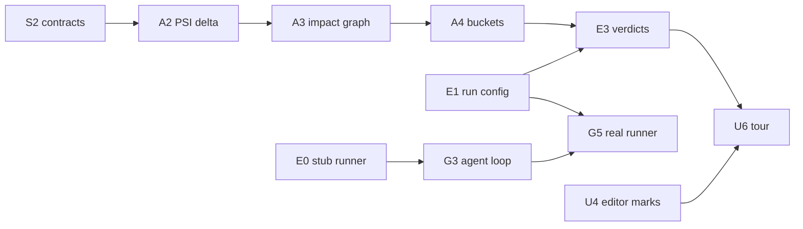

# Frictionless — Deliverables

Work breakdown for §5 (team split) and §6 (build plan) of [`specification.md`](./specification.md).

Four tracks run in parallel. They touch each other **only** through the frozen types in S2 and the
`TestRunner` interface in E0 — nothing else is a coupling point. Until a producer is real, every
consumer works against `FakeData`, so no track can block another and no single slip takes down the demo.

**ID key:** `S` shared · `A` analysis · `E` execution · `U` UI · `G` agent · `C` collaboration · `D` demo.
Tier: **must** ships or we have no product · **wow** the demo moment · **polish** · **stretch** cuttable.

---

## S — Shared (whole team, hour 0–2, blocks everything)

| ID | Deliverable | Done when | Tier |
|---|---|---|---|
| S1 | Plugin scaffold | `./gradlew runIde` opens a sandbox IDE with a **Frictionless** tool window and four toolbar actions stubbed (source picker, Run, Play, Share) | must |
| S2 | **Frozen contracts** | `ChangeSet`, `Source`, `ChangedMethod`, `Verdict`, `Bucket`, `VerdictCounts` compile, are committed, and are agreed out loud. No edits after hour 1 without telling all four tracks | must |
| S3 | Test fixture | A `ChangeSet` of three methods — one per bucket — in **`src/test` only**, so production code structurally cannot reach it. No toggle, no setting, no silent fallback: if analysis fails the ledger shows the error. Retired at hour 5, when A2 gives real methods with empty verdicts | must |
| S4 | Key smoke test | `scripts/smoke-openai.sh` returns OK on the demo machine. **Do this in hour one, not at 2am.** Adding the Koog dependency itself belongs to G1, which needs a resolvable version and network | must |

---

## A — Analysis (owns the idea; nothing after hour 9 matters if A3 is not done)

| ID | Deliverable | Depends on | Done when | Tier |
|---|---|---|---|---|
| A1 | Working-tree change set | S2 | `ChangeListManager` yields changed files for the current checkout | must |
| A2 | Method-level PSI delta | A1 | Base blob and head parsed as `PsiFile`s, compared at method level, emitting `ChangedMethod`s. Handles added, removed, modified | must |
| A3 | **Impact graph** | A2 | BFS via `ReferencesSearch` / `OverridingMethodsSearch` up the call graph, stopping at the test source root, populates `reachingTests`. Empty list is a valid, meaningful answer | must |
| A4 | Bucket assignment | A3 | Every `ChangedMethod` carries a `Verdict`; unverified is decided without running anything | must |
| A5 | Branch source | A2 | A git4idea ref-to-ref diff produces the same `ChangeSet` as A1. Analyser code is unchanged — that is the acceptance test | must |
| A6 | Blast radius | A2 | Call sites and callees resolved per method for the detail panel | must |

---

## E — Execution

| ID | Deliverable | Depends on | Done when | Tier |
|---|---|---|---|---|
| E0 | **`TestRunner` interface + stub** | S2 | Interface agreed and a stub returning canned results is committed **by hour 2** — the Agent track is blocked until it exists | must |
| E1 | Run configuration builder | E0 | A `JUnitConfiguration` is built programmatically from a list of test methods and launches | must |
| E2 | Result collection | E1 | `SMTRunnerEventsListener` yields per-test pass/fail/error, streamed as they arrive rather than batched at the end | must |
| E3 | Results → verdicts | E2, A4 | Proven and behaviour-changed buckets are populated from real runs; 🟡 means *a reaching test is red now* (§3.1) | must |

---

## U — UI (owns everything the judges actually see)

| ID | Deliverable | Depends on | Done when | Tier |
|---|---|---|---|---|
| U1 | Tool window + toolbar | S1, S3 | Ledger renders `FakeData` with a counts header. No default keybinding registered | must |
| U2 | Ledger rows | S2 | Rows grouped by bucket, colour-coded, each showing method, file and test count | must |
| U3 | Navigation | U2 | Row click opens the method; a behaviour-changed row opens the failing assertion | must |
| U4 | Editor marks | U2 | `LineMarkerProvider` gutter icons and `InlayHintsProvider` badges, updating live as verdicts arrive | must |
| U5 | Branch picker | A5 | Searchable popup over `GitBranchesCollection`, last base remembered, switching modes re-runs the ledger | must |
| U6 | **Autopilot tour** | U3, U4 | Play steps the five most interesting stops: scroll, spotlight, dim, one line per stop, cancellable | wow |
| U7 | Narration | U6 | Provider detected at startup (`piper` → `espeak-ng` → `spd-say` → `say`), identifiers humanised, utterances queued, process killed on cancel, silent fallback if no binary. Copy exactly as §3.6 | polish |
| U8 | Polish pass | U1–U6 | Icons, empty states, progress, dark theme, keyboard navigation, projector-legible font | polish |

---

## G — Agent (starts hour 2 against E0's stub — does **not** wait for E1)

| ID | Deliverable | Depends on | Done when | Tier |
|---|---|---|---|---|
| G1 | Koog wiring | S4, S2 | An agent loop runs with the run-test tool registered and callable | must |
| G2 | Context builder | A6 | Prompt carries the method, its callers' real arguments, and two or three existing tests as convention examples | must |
| G3 | Write → run → fix loop | G1, E0 | Generates a characterisation test, runs it, parses the failure, fixes, repeats. **Hard cap 3**, then reports honestly | must |
| G4 | File placement + fallback | G3 | Test lands in the right source root and package; a deterministic template test is emitted if the model call fails | must |
| G5 | Swap to real runner | E1, G3 | Same loop, real `TestRunner`, no other change. Red-to-green works end to end | must |

---

## C — Collaboration (stretch; first on the cut list)

| ID | Deliverable | Depends on | Done when | Tier |
|---|---|---|---|---|
| C1 | Share action | U1 | Toolbar action starts a Code With Me session and copies the invite link | stretch |
| C2 | **Two-IDE verification** | C1, U6 | Confirmed with an actual host and guest: the guest sees the tour. If the tool window does not render for the guest, that is expected (§3.5.1) — document it and move on | stretch |

---

## D — Demo (owned by whoever presents; start before hour 20)

| ID | Deliverable | Done when | Tier |
|---|---|---|---|
| D1 | Frozen demo repo | A Java/Kotlin repo on disk with a pre-baked multi-file AI change, git reset to a known point, reproducible in one command | must |
| D2 | Rehearsals | Five full runs on D1, offline, including the "judge opens a repo with no tests" case | must |
| D3 | Backup video | The full 90 seconds recorded and open in a tab | must |
| D4 | Slides | Trust statistic with citation, ledger screenshot, red-to-green clip, roadmap | must |

---

## Critical path

**S2 and E0 are the only true blockers.** Both are small, both are due in hour two, and both should be
written by one person while everyone else reads the spec. Everything else is parallel.

**Checkpoint hour 13:** A3, E3 and U2 must be real. If they are not, cut top-down from §6.1 immediately.
